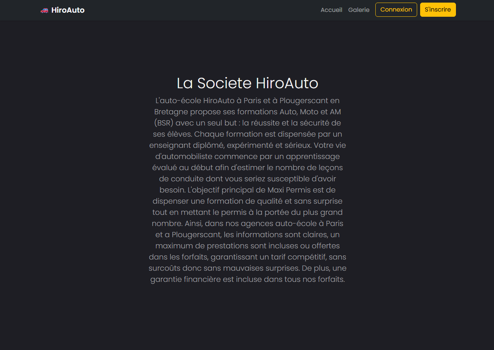
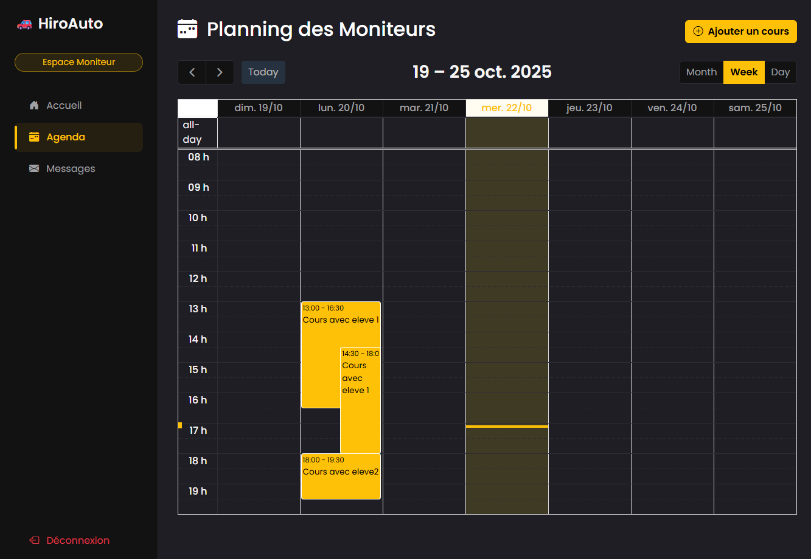
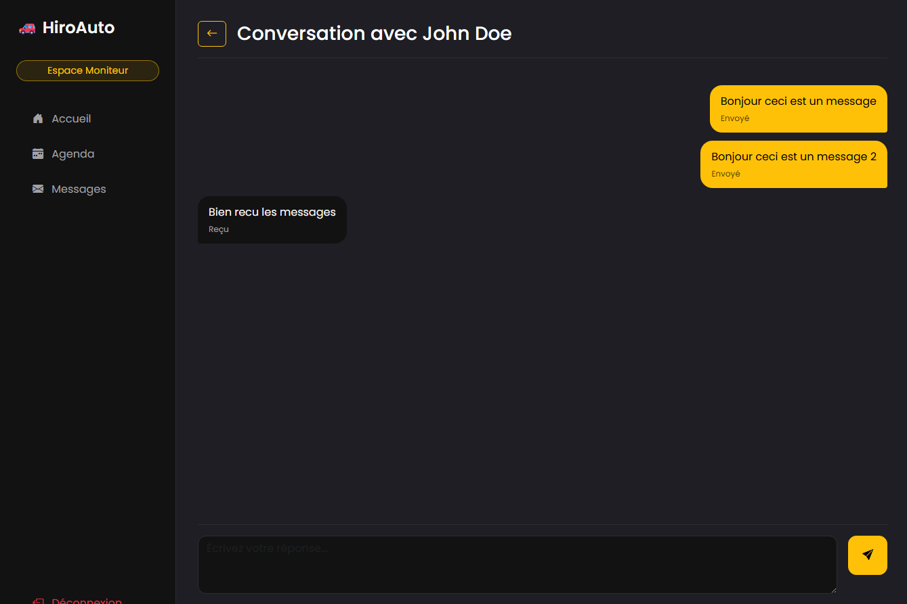
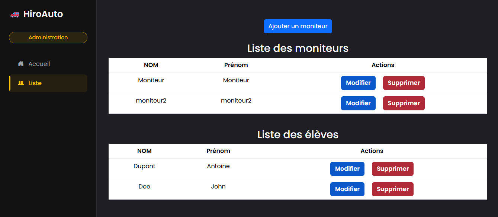

# Projet Auto-École

Site web de gestion pour auto-école. 
Permet aux élèves de s'inscrire, gérer leur agenda et communiquer, et à l'admin de gérer les profils.

---

### Accès au site (Exemples à adapter)

* **Compte Élève :**
    * Email : `eleve@exemple.com`
    * Mot de passe : `password123`

* **Compte Moniteur :**
    * Email : `moniteur@exemple.com`
    * Mot de passe : `password123`

* **Compte Admin :**
    * Email : `admin@exemple.com`
    * Mot de passe : `password123`

---

### Aperçus du projet

  <strong>Page d'Accueil</strong> 
    

 

  <strong>Fonctionnalité Agenda</strong> 
    

 

  <strong>Messagerie</strong> 
    

 

  <strong>Panel Admin (Gestion des profils)</strong> 
    

